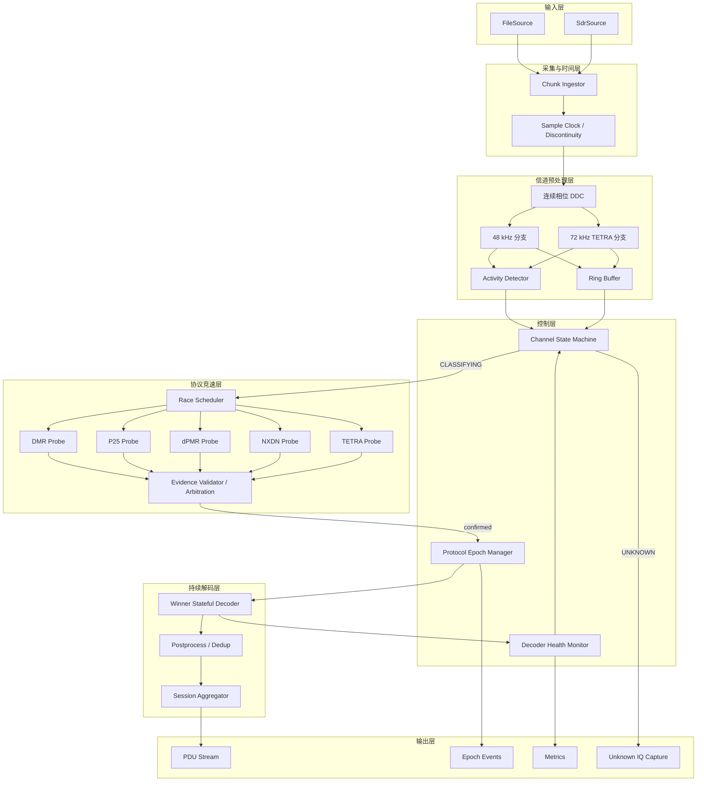
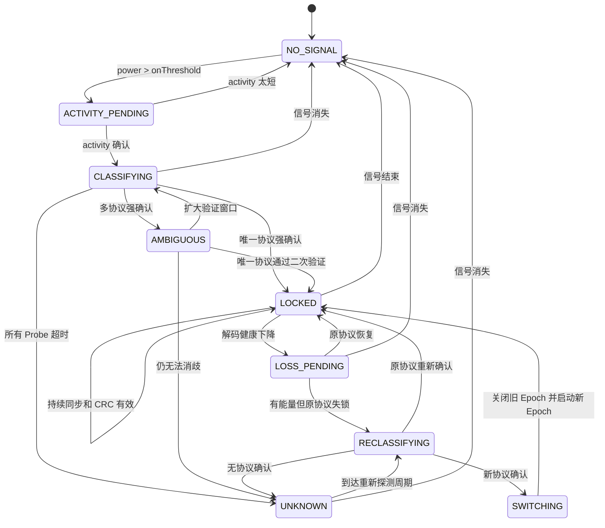
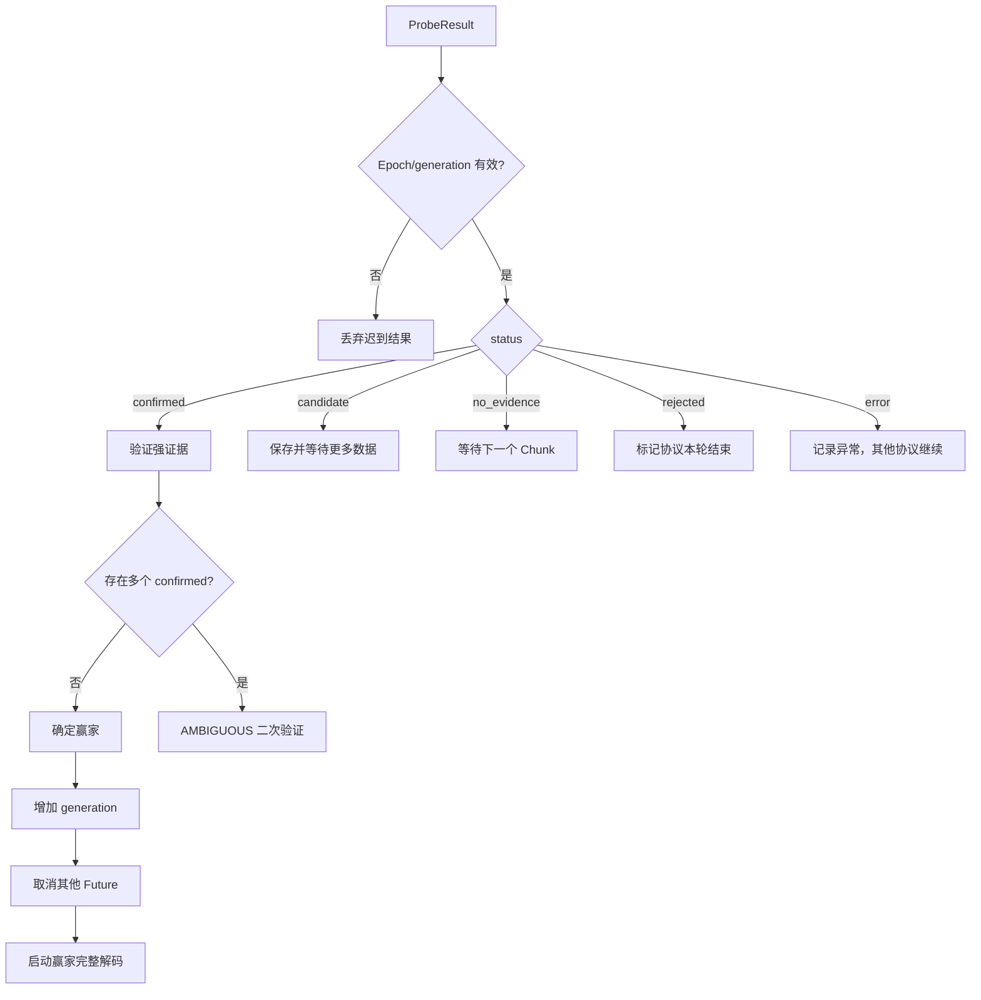
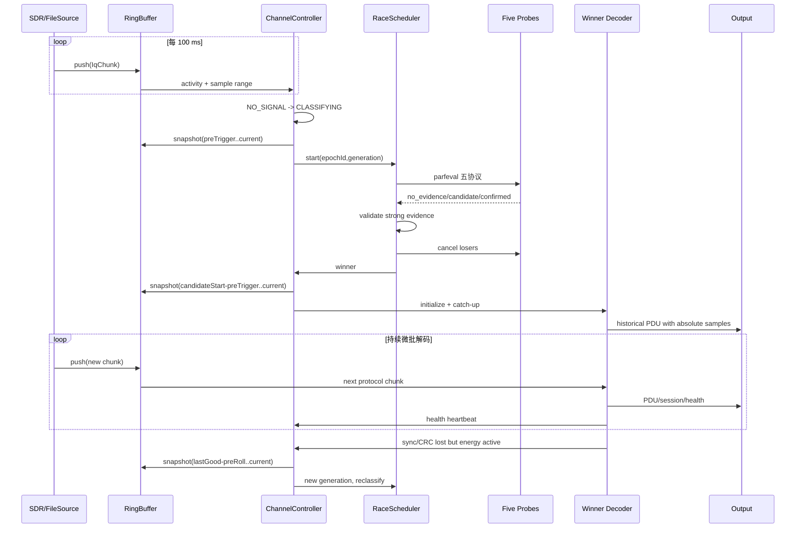

# 实时微批处理五制式并行识别架构设计

状态：后续并行化项目的详细设计基线，当前不改变串行运行代码。

日期：2026-07-10

## 1. 目标与决策

当前项目已经基本形成 DMR、P25 Phase 1、dPMR、NXDN96 和 TETRA DMO 五种
制式的离线直通模式信令、呼叫元数据和会话解码能力。下一阶段从稳定主线新建：

```text
feature/streaming-protocol-race
```

并行项目不应只是把五个现有完整解码器同时运行，而应面向最终 SDR 实时应用，
建立以下处理模型：

```text
连续流式采集
-> 微批处理
-> 活动检测
-> 五制式并行 Probe
-> 强证据确认
-> 单赢家持续解码
-> 健康监测
-> 失锁重分类
-> Protocol Epoch 输出
```

并行模式完成验收后可以成为产品默认路径，但串行调度器仍作为回归基线、故障
回退和误判诊断工具保留。串行和并行必须共用同一套协议解码器，不能复制出两套
长期独立维护的协议源码。

## 2. 范围

### 2.1 本阶段输入

```text
已知或已经下变频到中心的单个信道
协议未知
输入可能从通话中间开始
可能经历无信号、协议切换、未知信号或输入中断
```

### 2.2 本阶段输出

- 信号活动状态；
- 已确认协议及其确认依据；
- 协议 Epoch 起止位置；
- CRC/FEC 有效的 PDU；
- 呼叫和会话元数据；
- 解码健康状态；
- 无法识别时的 `UNKNOWN_SIGNAL`；
- 输入丢样、缓冲溢出、协议失锁等运行事件。

### 2.3 暂不纳入

- 多个频点之间的并行调度；
- TETRA TMO；
- 语音编解码和音频播放；
- 同频同时发射信号的多用户分离；
- C++ 实现本身，但接口必须保持便于迁移。

## 3. 当前五制式基线

| 制式 | 已形成的闭环 | 并行确认可使用的强证据 | 主要边界 |
|---|---|---|---|
| DMR | 同步、Slot Type、LC、Terminator、Late Entry、呼叫会话 | DMR Sync + 有效 Slot Type + RS 有效 LC，或有效 Late Entry CS5 | BPTC 纠错和 CSBK 字段仍有限，不解语音 |
| P25 | Frame Sync、BCH NID、HDU、LDU1、LDU2、会话 | Frame Sync + BCH 有效 NID | 当前目标是 Phase 1 元数据，不解语音 |
| dPMR | FS1/FS2、CCH、Color Code、ID、会话 | FS + CRC/Hamming 有效 CCH；低质量时要求重复 | FS1 真实样本仍需扩展，不解语音 |
| NXDN96 | FSW、LICH、SACCH、FACCH、UDCH、CAC、Layer 3、会话 | FSW + LICH + 至少一个 CRC 有效信道块 | 不支持 NXDN48/Type-D，不解 AMBE |
| TETRA DMO | DSB/DNB、SCH/S、SCH/H、DMAC-SYNC、DCC、STCH、会话 | 训练序列 + 固定字段 + RCPC/parity/tail 有效控制块 | TCH 和部分 MAC 字段未完成，不含 TMO |

这意味着项目可以进入并行优化阶段，但里程碑应表述为“五制式直通模式识别和
信令/会话解码”，不能表述为“五制式全部业务内容和语音完整解码”。

## 4. 总体架构



未来扩展多频点时，在该架构外增加 ChannelManager 和 channelizer，为每个候选
频点创建独立的 ChannelController。本阶段只实现一个已知频点的控制器。

## 5. 运行模型：流式输入加微批处理

最终输入是连续 SDR 数据流，但协议算法以固定小批次处理。初始建议：

```matlab
ChunkDurationSec = 0.100;
```

每 100 ms 形成一个 `IqChunk`。它足够小，可以控制识别和输出延迟；同时 DMR、
dPMR、NXDN、P25 和 TETRA 可以在多个 Chunk 之间累积协议状态。后续应对 50、100、
200 ms 做性能和延迟对比，不把 100 ms 视为不可修改的协议常量。

FileSource 和 SdrSource 必须提供相同的 Chunk 接口。离线文件可以选择按实时速度
回放或尽快处理，从而在接入真实 SDR 前完成状态机、积压、丢样和切换测试。

## 6. 核心数据结构

### 6.1 IqChunk

```matlab
chunk = struct( ...
    'channelId', 1, ...
    'sequenceNumber', uint64(1001), ...
    'sourceSampleStart', uint64(1000000), ...
    'sourceSampleEnd', uint64(1007812), ...
    'timestampStartNs', uint64(0), ...
    'centerFrequencyHz', 430050000, ...
    'sampleRateHz', 78125, ...
    'iq', complex(single([])), ...
    'discontinuity', false, ...
    'droppedSourceSamples', uint64(0));
```

绝对采样编号不能省略。它用于多批次排序、PDU 去重、Epoch 边界、缓冲追赶、
重采样位置映射和 SDR 丢样检测。

实现统一采用从 0 开始的绝对采样编号，`sourceSampleStart` 为包含端，
`sourceSampleEnd` 为不包含端，即 Chunk 样本数恒等于
`sourceSampleEnd-sourceSampleStart`。

### 6.2 ProbeResult

```matlab
result = struct( ...
    'epochId', uint64(7), ...
    'generation', uint64(3), ...
    'protocol', 'NXDN', ...
    'status', 'confirmed', ...
    'confidence', 0.99, ...
    'evidenceClass', 'crc_valid_channel_block', ...
    'evidence', struct(), ...
    'windowStartSample', uint64(0), ...
    'windowEndSample', uint64(0), ...
    'consumedSamples', uint64(0), ...
    'frequencyOffsetHz', 0.0, ...
    'timingState', struct(), ...
    'decoderCheckpoint', struct(), ...
    'elapsedSec', 0.0, ...
    'reason', '');
```

`epochId` 和 `generation` 用于拒绝已取消 Epoch 的迟到 Future。即使
`cancel(future)` 没能立即停止内部计算，旧结果也不能改变当前协议状态。

### 6.3 ProtocolEpoch

```matlab
epoch = struct( ...
    'channelId', 1, ...
    'epochId', uint64(7), ...
    'state', 'LOCKED', ...
    'protocol', 'NXDN', ...
    'candidateStartSample', uint64(0), ...
    'decodeStartSample', uint64(0), ...
    'lockSample', uint64(0), ...
    'lastGoodSample', uint64(0), ...
    'endSample', [], ...
    'confidence', 0.99, ...
    'frequencyOffsetHz', 0.0, ...
    'closeReason', '', ...
    'ambiguousInterval', []);
```

### 6.4 DecoderHealth

```matlab
health = struct( ...
    'protocol', 'NXDN', ...
    'lastSyncSample', uint64(0), ...
    'lastValidBlockSample', uint64(0), ...
    'validBlockCount', 0, ...
    'invalidBlockCount', 0, ...
    'crcPassRatio', 0.0, ...
    'meanSyncScore', 0.0, ...
    'frequencyOffsetHz', 0.0, ...
    'frequencyDriftHzPerSec', 0.0, ...
    'timingDrift', 0.0, ...
    'consecutiveInvalidFrames', 0, ...
    'status', 'healthy');
```

## 7. 信道状态机



协议锁定只对当前 Epoch 有效，不能根据文件前部的一次识别假设后续内容永久保持
同一制式。

## 8. 活动检测与无信号处理

必须明确区分：

```text
NO_SIGNAL       没有明显信道能量
UNKNOWN_SIGNAL  有能量，但五个协议均未强确认
KNOWN_PROTOCOL  某协议已经通过强校验
```

初始活动检测可以组合时域平均功率、Welch 带内功率、噪声底提升量、占用带宽和
持续时间。建议采用迟滞门限：

```matlab
activityOnThresholdDb  = noiseFloorDb + 10;
activityOffThresholdDb = noiseFloorDb + 6;
activityMinOnSec       = 0.050;
activityOffHangSec     = 0.300;
```

这些只是研究初值，必须用真实 SDR 噪声环境标定。噪声底只在 `NO_SIGNAL` 状态
更新；信号活动期间应冻结或极慢更新，避免把持续载波学习成噪声。

对于 `UNKNOWN_SIGNAL`，使用低占空比指数退避重新探测：

```text
0.5 s -> 1 s -> 2 s -> 4 s
```

同时保存有限长度的未知 IQ，供后续添加新协议和调整门限。

## 9. 环形缓冲和不丢数据策略

Probe 只能读取环形缓冲区快照，不能消费并删除输入。协议确认时 SDR 已经继续采集，
赢家必须从活动开始附近追赶解码：

```text
信号开始             协议确认              当前实时位置
   A--------------------B----------------------C
   ^                                           ^
完整解码从 A-preTrigger 开始                   先追赶到 C
```

单个已知信道建议保存 48 kHz 和 72 kHz 两个复数 IQ 环形缓冲，不长期保留完整宽带
double IQ。初始配置：

```matlab
ringBufferSec = 8.0;
preTriggerSec = 0.5;
```

8 秒可以覆盖 TETRA 当前最长约 6 秒的扫描窗口，并保留预触发和追赶余量。使用
complex single 时，48 kHz 与 72 kHz 两个 8 秒缓冲合计约 7.68 MB/信道。

建议接口：

```matlab
ringBufferPush(buffer, chunk)
ringBufferRange(buffer, startSample, endSample)
ringBufferLatest(buffer, durationSec)
```

快照必须携带绝对采样范围、采样率、丢样标记、重采样比和群时延。赢家确认后：

1. 读取 `candidateStart-preTrigger` 到当前位置；
2. 初始化赢家解码器；
3. 快速处理积压数据；
4. 追赶到实时位置；
5. 转入逐 Chunk 持续解码。

## 10. Probe 窗口策略

现有配置对应的关键周期：

| 制式 | 关键周期 |
|---|---|
| DMR | 4800 symbol/s，voice burst stride 为 60 ms，Late Entry 跨多个 burst |
| P25 | 4800 symbol/s，完整 864-symbol LDU 约 180 ms |
| dPMR | 2400 symbol/s，384-symbol frame 约 160 ms |
| NXDN96 | 192-symbol frame 为 40 ms，四段 SACCH 超帧约 160 ms |
| TETRA DMO | 255-symbol slot 约 14.17 ms，但有效 DMO 控制突发可能稀疏 |

不能使用一个固定窗口统一决定所有协议。建议初始研究范围：

| 制式 | 首次 Probe | 推荐确认窗口 | 最大窗口 |
|---|---:|---:|---:|
| P25 | 0.10–0.25 s | 0.25–0.50 s | 1.0 s |
| NXDN96 | 0.16–0.25 s | 0.32–0.50 s | 1.0 s |
| DMR | 0.30–0.40 s | 0.60–0.80 s | 1.5 s |
| dPMR | 0.32–0.40 s | 0.64–0.80 s | 1.5 s |
| TETRA DMO | 0.50 s | 1.0–2.5 s | 6.0 s |

这些数值不是协议常量。最终数值必须通过真实样本起点扫描确定：从不同时间偏移
进入同一录音，测量 `time_to_first_sync`、`time_to_first_valid_crc` 和
`time_to_confirm`，再以 P95/P99 加安全余量确定最大窗口。

Probe 应随 100 ms Chunk 渐进累积：达到协议最小窗口前返回 `pending`；短窗口未找到
同步返回 `no_evidence`；只有超过协议最大时限才返回当前 Epoch 的 `rejected`。

## 11. 五制式强确认规则

### 11.1 DMR

```text
DMR Sync
+ Golay 有效 Slot Type
+ RS 有效 Full Link Control
```

或者有效 Voice Late Entry、VBPTC 结构和 CS5。当前 CSBK 地址与强校验能力有限，
CSBK 不能单独作为 `confirmed`。

### 11.2 P25

```text
P25 Frame Sync
+ BCH 有效 NID
```

稳定 NAC 但 BCH 无效只能作为 `candidate`。

### 11.3 dPMR

```text
FS1/FS2
+ Hamming 有效 CCH
+ CRC 有效 CCH
```

质量一般时要求至少两个一致 Color Code/CCH 记录。

### 11.4 NXDN96

```text
FSW
+ 有效 LICH
+ 至少一个 CRC 有效 SACCH/FACCH/UDCH/CAC 块
```

只有 FSW 或 LICH 不能宣布确认。

### 11.5 TETRA DMO

```text
训练序列
+ DSB/DNB 固定字段
+ RCPC Viterbi
+ block-code parity
+ tail 校验
```

最好进一步得到 DMAC-SYNC、STCH 或 SCH/F。只有训练序列命中不能宣布确认。

## 12. 并行竞速调度

使用持久进程池，不能为每个 Epoch 重建：

```matlab
pool = gcp('nocreate');
if isempty(pool)
    pool = parpool('Processes', workerCount);
end
```

每个 Epoch、每个协议最多存在一个未完成 Future：

```matlab
future = parfeval(pool, @radio.race.runProbeTask, 1, ...
    protocolName, probeInput, probeState, probeConfig, epochId, generation);
```

协调器不能无限阻塞等待 `fetchNext`，否则可能影响 SDR 采集。应使用有超时的轮询
或在每个新 Chunk 到达时检查 Future 状态。采集和环形缓冲写入始终具有最高优先级。

收到结果后的流程：



如果两个协议同时强确认，不能按 Future 返回速度选赢家。应进入 `AMBIGUOUS`，只对
相关协议扩大窗口并要求更多独立校验证据；仍无法消歧则输出未知并保存 IQ。

## 13. 共享前端和数据传输

已知频点只执行一次 DDC，并生成 48 kHz 与 72 kHz 分支。DMR/P25 继续共享
`c4fm_4fsk` 前端：

```matlab
inputs.iq48
inputs.c4fm48
inputs.iq72
inputs.sampleRange
inputs.discontinuity
```

| 协议 | Probe 输入 |
|---|---|
| DMR | `c4fm48` |
| P25 | `c4fm48` |
| dPMR | `iq48` 或 dPMR 前端结果 |
| NXDN | `iq48` 或 NXDN 前端结果 |
| TETRA | `iq72` |

不能把整个文件复制到五个 worker。只传递当前 Probe 窗口；协议锁定后只保留赢家。
第一版可以在协调端构建共享前端，优化版改为 worker 保存增量前端状态、每次只接收
新增 Chunk。

## 14. 流式 DSP 技术要求

当前离线前端的 `filtfilt` 和整段 `resample` 不能直接作为最终实时实现。

### 14.1 连续 DDC

每个 Chunk 不能重置 NCO 相位：

```text
phase0_next = mod(phase0 + 2*pi*fo*N/fs, 2*pi)
```

也可以使用绝对采样编号计算相位。

### 14.2 因果 FIR

实时 FIR 保存 `zi/zf`：

```matlab
[y, zf] = filter(b, 1, x, zi);
```

并补偿群时延。第一阶段离线并行研究可以继续复用 `filtfilt`，流式阶段必须实现因果
版本并重新标定同步阈值。

### 14.3 FM 鉴频边界

每个 Chunk 保存前一 Chunk 的最后一个复数 IQ 样本，用于第一个相位差，避免边界
跳变和丢样。

### 14.4 流式重采样

保存多相滤波状态、分数采样相位、输入输出绝对位置和群时延。可以使用持久 DSP
System Object 或自定义 polyphase resampler。

### 14.5 同步跨 Chunk

每个协议保存至少一个同步模板长度加帧起始余量的尾部：

```text
previousTail + newChunk -> sync search
```

只输出锚点位于尚未处理绝对采样区间内的结果。

## 15. 赢家持续解码

第一版可以用重叠窗口适配现有整数组解码器：

```text
上一批尾部 + 新 Chunk
-> 现有 decode
-> 转换绝对位置
-> 只发出未输出 PDU
```

它适合验证正确性，但存在重复计算，不能作为最终高性能方案。最终各协议应实现
`decodeChunk` 并保存：

| 制式 | 主要跨批状态 |
|---|---|
| DMR | FIR/FM、sync tail、Late Entry fragments、Color Code、call session |
| P25 | sync tail、NID/frame assembly、未完成 LDU、NAC、call session |
| dPMR | FS tail、384-symbol frame、CCH ID fragments、stable color、session |
| NXDN | FSW tail、192-symbol frame、SACCH assembler、RAN、session |
| TETRA | RRC、差分相位、timing、slot buffer、DCC、FN/TN、DMO session |

## 16. 锁定健康、失锁和协议切换

赢家持续更新最近同步、最近有效块、CRC 通过率、频偏、定时漂移和连续失败帧数。
使用三级状态：

```text
HEALTHY -> SUSPECT -> LOST
```

初始研究范围：

| 制式 | suspect | lost |
|---|---:|---:|
| P25 | 0.3–0.5 s | 0.8–1.2 s |
| NXDN | 0.2–0.4 s | 0.6–1.0 s |
| DMR | 0.4–0.7 s | 1.0–1.5 s |
| dPMR | 0.4–0.7 s | 1.0–1.5 s |
| TETRA DMO | 1.0–2.0 s | 3.0–6.0 s |

这些数值也必须从真实有效 PDU 重复周期统计得到。

同一频点无静默切换时，原协议同步和 CRC 会下降但信道能量仍然存在。状态机进入
`LOSS_PENDING`，从环形缓冲区重新运行五制式 Probe。旧协议最后有效 PDU 与新协议
第一个强证据之间是模糊区间，不能伪造精确切换时刻。

两个信号同频同时发射通常表现为所有协议质量下降，应输出 `UNKNOWN_COLLISION`。
单信道解码器不能保证分离此类碰撞。

## 17. 完整时序



## 18. API 和配置

保留当前串行入口：

```matlab
radio.scanFile(file, ...
    'FreqList', knownOffset, ...
    'BlindSearch', false, ...
    'ExecutionMode', 'serial');
```

新增模式：

```text
serial             当前完整串行基线
serial-probe       新 Probe 接口串行执行
parallel-race      五协议 parfeval 竞速
streaming-parallel 完整微批、Epoch、重分类路径
```

建议统一配置：

```matlab
cfg.stream.chunkDurationSec = 0.100;
cfg.stream.ringBufferSec = 8.0;
cfg.stream.preTriggerSec = 0.5;
cfg.stream.maxCatchupLagSec = 4.0;

cfg.activity.onThresholdDb = 10.0;
cfg.activity.offThresholdDb = 6.0;
cfg.activity.minOnSec = 0.050;
cfg.activity.offHangSec = 0.300;

cfg.race.executionMode = 'parallel-race';
cfg.race.workerCount = 5;
cfg.race.unknownReprobeInitialSec = 0.5;
cfg.race.unknownReprobeMaxSec = 4.0;
cfg.race.cancelOnConfirmed = true;
cfg.race.ambiguousSecondPass = true;
```

协议 `spec` 增加：

```text
probeFcn
probeStateInitFcn
decodeChunkFcn
probeInitialWindowSec
probeMaxWindowSec
suspectTimeoutSec
lostTimeoutSec
supportsParallelProbe
```

## 19. 输出和可观测性

运行结果建议包含：

```matlab
result.pdus
result.sessions
result.epochs
result.unknownSegments
result.metrics
result.errors
```

统一 PDU 增加：

```text
channel_id
epoch_id
absolute_sample
timestamp_ns
center_frequency_hz
protocol_confidence
```

必须记录：协议准确率、误确认率、UNKNOWN率、time-to-confirm、失锁和重分类时间、
串并行 PDU 一致性、CRC 通过率、CPU、内存、缓冲高水位、Future 取消延迟、输入到
PDU 延迟和实时因子。

定义：

```text
realTimeFactor = processingTime / signalDuration
```

长期运行必须小于 1，建议目标平均不高于 0.7，留出 SDR、UI、输出和短时 Probe 峰值
的资源余量。

## 20. 异常与背压

SDR 报告丢样时，输出 `INPUT_DISCONTINUITY`，关闭当前 Epoch，清除 FIR、重采样、
同步和帧组装状态并重新识别，不能跨丢样点继续拼接 CRC 帧。

单个 Probe 异常只标记该协议本轮 `error`，其他协议继续。整个 pool 失败时回退
`serial-probe`，不能停止输入采集。

持续监控生产者和消费者绝对采样差。如果环形缓冲覆盖尚未消费的数据，输出
`BUFFER_OVERRUN`，异常关闭当前 Epoch，并从最新数据重新分类。

## 21. 测试矩阵

### 21.1 单协议起点扫描

以 10 ms 或适当步长遍历真实样本起点，覆盖从通话中间进入的情况，统计各协议
time-to-confirm 分布。

### 21.2 截断窗口

对 50 ms、100 ms、200 ms、500 ms、1 s、2 s 等长度验证 `pending`、
`no_evidence` 和 `confirmed`。短窗口不能错误返回永久拒绝。

### 21.3 五乘五交叉误判

每种真实协议必须只被对应 Probe 强确认，其他四个 Probe 不得返回 `confirmed`。

### 21.4 拼接场景

```text
silence + DMR + silence + NXDN
DMR + P25（无静默）
dPMR + unknown + TETRA
短突发 + silence
输入丢样和 Chunk 抖动
```

### 21.5 串并行一致性

比较 `serial`、`parallel-race` 和 `streaming-parallel` 的协议、src/dst、呼叫类型、
RAN/NAC/Color Code、PDU 类型、关键 payload、会话数量、绝对时间和去重结果。

## 22. 验收标准

1. 五种真实样本全部识别正确；
2. 五乘五交叉误判矩阵没有错误强确认；
3. 纯噪声返回 `NO_SIGNAL`；
4. 有能量但未知信号返回 `UNKNOWN_SIGNAL`；
5. 协议切换创建新的 Epoch；
6. Probe 期间采集数据不丢失；
7. 赢家从预触发位置追赶解码；
8. 串行与并行关键 PDU 一致；
9. 迟到 Future 不污染新 Epoch；
10. 丢样触发状态清理；
11. 平均实时因子小于 1，目标不高于 0.7；
12. 现有 `tests.runAll` 和 golden regression 继续通过；
13. 无 Parallel Toolbox 时可回退串行；
14. 新协议只需注册 Probe/Decode，不修改竞速调度器核心。

## 23. 实施阶段

### 阶段 0：建立分支和基线

从稳定主线建立 `feature/streaming-protocol-race`，记录五协议串行 PDU、耗时、CPU、
内存和 golden 结果。

### 阶段 1：流式数据骨架

实现 IqChunk、FileSource、绝对采样编号、环形缓冲、Activity Detector、
ChannelController 和 Epoch，暂不并行。

截至 2026-07-13，阶段 1 已在 `feature/streaming-protocol-race` 分支实现：

- `radio.stream.makeIqChunk/validateIqChunk`：统一 Chunk 契约和绝对采样时间轴；
- `radio.stream.fileSource*`：RAW IQ 与双通道 WAV 的 100 ms 分块输入；
- `radio.stream.ringBuffer*`：固定容量 complex-single 环形缓冲及绝对范围快照；
- `radio.stream.activityDetector*`：噪声底、开关迟滞、最短活动和关闭保持；
- `radio.stream.channelController*`：`NO_SIGNAL`、`ACTIVITY_PENDING`、
  `CLASSIFYING` 及 Epoch 建立/关闭；
- `tests.runStreamingPhase1`：覆盖文件重组、回绕取段、活动迟滞和丢样清理。

本阶段没有修改现有串行 scanner 和五个协议解码器；`CLASSIFYING` 之后的协议判定
由阶段 2 的串行 Probe 接口接管。

### 阶段 2：串行 Probe

实现五个协议 Probe，由 `serial-probe` 依次调用，先验证确认语义、窗口和交叉误判。

### 阶段 3：窗口统计

执行起点、SNR、频偏和截断扫描，确定协议初始窗口、最大窗口、suspect 和 lost
超时。

### 阶段 4：并行 Race

加入持久 parpool、parfeval、Future 管理、epoch/generation、取消、AMBIGUOUS 和
pool 回退。

### 阶段 5：赢家追赶

协议确认后从 pre-trigger 开始完整解码并追赶实时位置，第一版使用重叠窗口兼容层。

### 阶段 6：增量协议解码

逐步实现协议 `decodeChunk` 和持续前端状态，建议先 NXDN/P25，再 dPMR/DMR，最后
处理状态最复杂的 TETRA。

### 阶段 7：健康和切换

实现 LOCKED、LOSS_PENDING、RECLASSIFYING、SWITCHING、UNKNOWN 及 Epoch 关闭原因。

### 阶段 8：SDR 接入

用 SdrSource 替换 FileSource，保持下游接口不变，进行长时间空口、无信号、短突发、
多次通话、协议变化和 SDR 溢出测试。

### 阶段 9：默认切换

全部验收通过后让 `streaming-parallel` 成为产品默认路径，保留 `serial` 作为测试和
故障回退。

## 24. C++ 迁移约束

协议接口保持语言无关：

```text
ProbeState + IqChunk -> ProbeResult + NewProbeState
DecoderState + IqChunk -> PDU[] + Health + NewDecoderState
```

协议模块不能直接依赖 MATLAB Future、UI、scanner 脚本或全局变量。未来映射：

| MATLAB | C++ |
|---|---|
| `parfeval` | thread pool/task future |
| struct | POD/struct |
| function-handle registry | interface/vtable registry |
| 环形数组 | lock-free ring buffer |
| DataQueue | concurrent queue |
| Epoch generation | atomic generation counter |
| `cancel(future)` | stop/cancellation token |

这样迁移时主要替换调度层、DSP 实现和数据容器；协议确认规则、Epoch 语义、测试向量
和验收标准可以保留。

## 25. 最终设计结论

并行项目应按以下目标一次性建立正确方向：

```text
流式输入
+ 100 ms 初始微批
+ 8 s 初始环形缓冲
+ 活动检测
+ 协议独立渐进 Probe
+ 五制式并行竞速
+ 强证据确认
+ 单赢家持续解码
+ 健康监测
+ 失锁重分类
+ Protocol Epoch
```

最关键的约束是：Probe 不消费数据；协议锁定只在当前 Epoch 内有效；先完成流式
数据、状态和 Probe 接口，再接入 parfeval。否则容易得到只能并行扫描整段文件、
无法平滑进入 SDR 实时处理的临时实现。
